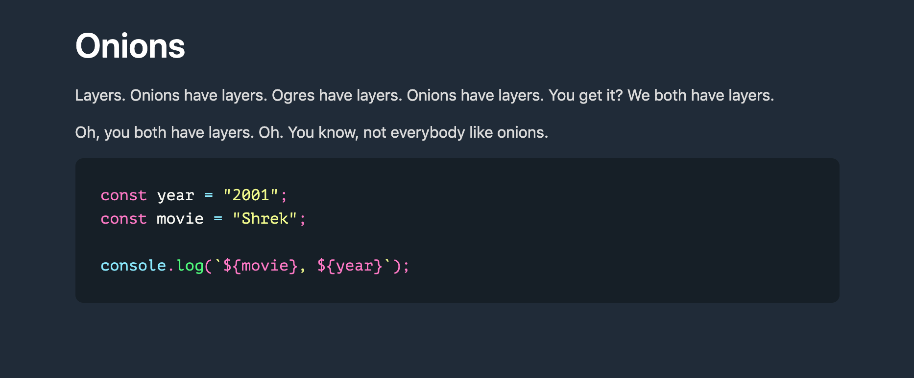

# Next.js-MDX-Prism-Example

A Next.js project example with MDX and Prism code highlighting.



## Getting Started

First, run the development server:

```bash
yarn dev
```

Open [http://localhost:3000/onions](http://localhost:3000/onions) with your browser to see the result.

You can start editing the page by modifying `pages/onions.mdx`.

## [Dev.to post](https://dev.to/mikeesto/next-js-mdx-w-code-highlighting-16fi)
